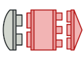

# Design Pattern

- `Design Pattern` kế là giải pháp điển hình cho các vấn đề thường gặp trong thiết kế phần mềm. Mỗi mẫu giống như một bản thiết kế mà bạn có thể tùy chỉnh để giải quyết một vấn đề thiết kế cụ thể trong mã của mình.

- `Design Pattern` là một bộ công cụ giải pháp cho các vấn đề thường gặp trong thiết kế phần mềm. Họ xác định một ngôn ngữ chung giúp nhóm của bạn giao tiếp hiệu quả hơn.

- `Design Pattern` khác nhau bởi độ phức tạp, mức độ chi tiết và quy mô khả năng ứng dụng của chúng. Ngoài ra, chúng có thể được phân loại theo mục đích của chúng và được chia thành ba nhóm

## Creational Pattern - Nhóm khởi tạo

### Factory Method

Cung cấp giao diện để tạo các đối tượng trong lớp cha, nhưng cho phép lớp con thay đổi loại đối tượng sẽ được tạo.

### Abstract Factory

Cho phép bạn tạo ra các họ các đối tượng liên quan mà không cần chỉ định các lớp cụ thể của chúng.

### Builder 

Cho phép bạn xây dựng các đối tượng phức tạp theo từng bước. Mẫu cho phép bạn tạo ra các kiểu và biểu diễn khác nhau của một đối tượng bằng cách sử dụng cùng một mã xây dựng.

### Singleton

Cho phép bạn sao chép các đối tượng hiện có mà không làm cho mã của bạn phụ thuộc vào các lớp của chúng.

### Prototype

Cho phép bạn đảm bảo rằng một lớp chỉ có một thể hiện, đồng thời cung cấp một điểm truy cập toàn cục cho thể hiện này.

## Structural Pattern - Nhóm cấu trúc

### Adapter

### Bridge

### Composite

### Decorator

### Facade

### Flyweight

### Proxy

## Behavioral Pattern - Nhóm hành vi

### Chain of Responsibility

### Command

### Iterator

### Mediator

### Memento

### Observer

### State

### Strategy

### Template Method

### Visitor

